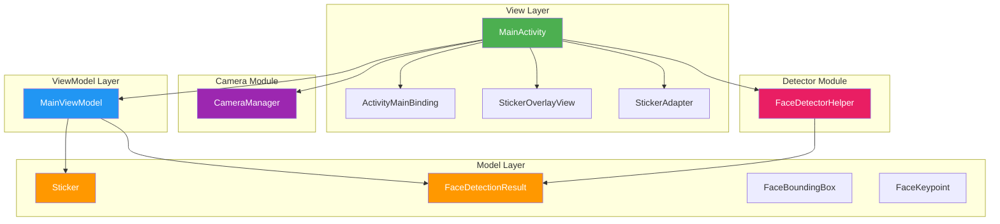
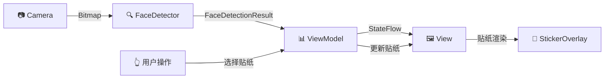

# 📸 FaceSticker - Android 实时人脸贴纸应用


> 🎭 一款基于 CameraX 和 MediaPipe 的实时人脸贴纸应用，支持多种趣味贴纸效果

---

## ✨ 功能特性

- 🔍 **实时人脸检测** - 基于 MediaPipe Face Detection 的高精度人脸识别
- 🎨 **多样贴纸效果** - 8 种不同类型的趣味贴纸（眼镜、帽子、猫耳、胡子、狗鼻子、皇冠、面具等）
- 📱 **前后摄像头切换** - 支持一键切换前后摄像头
- 🖼️ **实时贴纸渲染** - 贴纸跟随人脸实时移动和缩放
- 🐛 **调试模式** - 可视化人脸边界框和关键点信息
- 🎯 **多人脸支持** - 同时检测和渲染多张人脸的贴纸


---

## 🏗️ 系统架构

本项目采用 **MVVM (Model-View-ViewModel)** 架构模式，实现了清晰的关注点分离和可测试性。

### 架构图



### 数据流向



---

## 📁 项目结构

```
app/src/main/java/com/youdao/course/myapplication/
├── 📄 MainActivity.kt          # 主界面 Activity，整合所有功能模块
├── 📂 viewmodel/
│   └── 📄 MainViewModel.kt     # 主界面 ViewModel，管理 UI 状态
├── 📂 model/
│   └── 📄 Sticker.kt           # 数据模型（贴纸、人脸检测结果）
├── 📂 view/
│   └── 📄 StickerOverlayView.kt # 自定义 View，渲染贴纸叠加层
├── 📂 camera/
│   └── 📄 CameraManager.kt     # CameraX 相机管理器
├── 📂 detector/
│   └── 📄 FaceDetectorHelper.kt # MediaPipe 人脸检测封装
└── 📂 adapter/
    └── 📄 StickerAdapter.kt    # 贴纸列表 RecyclerView 适配器
```

### 模块说明

| 模块 | 职责 | 核心类 |
|------|------|--------|
| **View** | 用户界面和交互 | `MainActivity`, `StickerOverlayView` |
| **ViewModel** | UI 状态管理和业务逻辑 | `MainViewModel` |
| **Model** | 数据定义 | `Sticker`, `FaceDetectionResult` |
| **Camera** | 相机预览和图像分析 | `CameraManager` |
| **Detector** | 人脸检测 | `FaceDetectorHelper` |

---

## 🛠️ 技术栈

| 类别 | 技术 | 版本 |
|------|------|------|
| **语言** | Kotlin | 1.9+ |
| **最低 SDK** | Android 7.0 | API 24 |
| **目标 SDK** | Android 15 | API 36 |
| **相机** | CameraX | 1.3+ |
| **人脸检测** | MediaPipe Face Detection | Latest |
| **异步处理** | Kotlin Coroutines | 1.7+ |
| **视图绑定** | ViewBinding | - |
| **架构组件** | AndroidX Lifecycle | 2.6+ |
| **UI 组件** | Material Design 3 | 1.9+ |

---

## 🚀 快速开始

### 环境要求

- Android Studio Hedgehog (2023.1.1) 或更高版本
- JDK 11 或更高版本
- Android SDK 36
- Gradle 8.0+

### 安装步骤

1. **克隆仓库**
   ```bash
   git clone https://github.com/yourusername/FaceSticker.git
   cd FaceSticker
   ```

2. **使用 Android Studio 打开项目**
   ```
   File -> Open -> 选择项目目录
   ```

3. **同步 Gradle 依赖**
   ```
   等待 Gradle 同步完成
   ```

4. **运行应用**
   ```
   连接 Android 设备或启动模拟器，点击 Run
   ```

### 权限说明

应用需要以下权限：

```xml
<uses-permission android:name="android.permission.CAMERA" />
```

首次运行时，应用会请求相机权限。请允许权限以正常使用所有功能。

---

## 🎮 使用指南

1. **启动应用** - 授予相机权限后，应用将自动开始人脸检测
2. **选择贴纸** - 从底部贴纸栏选择喜欢的贴纸
3. **切换摄像头** - 点击右上角的摄像头切换按钮
4. **调试模式** - 点击调试按钮可查看人脸边界框和关键点

### 可用贴纸

| 贴纸 | 类型 | 位置 |
|------|------|------|
| 👓 眼镜 | GLASSES | 眼部区域 |
| 🎩 帽子 | HAT | 头顶 |
| 🐱 猫耳 | CAT_EARS | 头顶两侧 |
| 🥸 胡子 | MUSTACHE | 嘴唇上方 |
| 🐶 狗鼻子 | DOG_NOSE | 鼻子区域 |
| 👑 皇冠 | CROWN | 头顶 |
| 🎭 面具 | MASK | 面部中央 |

---

## 📦 依赖库

```kotlin
dependencies {
    // Core
    implementation("androidx.core:core-ktx")
    implementation("androidx.appcompat:appcompat")
    implementation("com.google.android.material:material")
    
    // CameraX
    implementation("androidx.camera:camera-core")
    implementation("androidx.camera:camera-camera2")
    implementation("androidx.camera:camera-lifecycle")
    implementation("androidx.camera:camera-view")
    
    // MediaPipe
    implementation("com.google.mediapipe:tasks-vision")
    
    // Lifecycle & ViewModel
    implementation("androidx.lifecycle:lifecycle-runtime-ktx")
    implementation("androidx.lifecycle:lifecycle-viewmodel-ktx")
    
    // Coroutines
    implementation("org.jetbrains.kotlinx:kotlinx-coroutines-android")
}
```

---

## 🤝 贡献指南

欢迎提交 Issue 和 Pull Request！

1. Fork 本仓库
2. 创建特性分支 (`git checkout -b feature/AmazingFeature`)
3. 提交更改 (`git commit -m 'Add some AmazingFeature'`)
4. 推送到分支 (`git push origin feature/AmazingFeature`)
5. 提交 Pull Request

---

## 📄 许可证

本项目采用 MIT 许可证 - 查看 [LICENSE](LICENSE) 文件了解详情

---

## 👨‍💻 作者

- **有道** - [GitHub](https://github.com/youdao)

---

## 🙏 致谢

- [MediaPipe](https://developers.google.com/mediapipe) - 高性能机器学习解决方案
- [CameraX](https://developer.android.com/training/camerax) - 简化的相机开发体验
- [Material Design](https://material.io/) - 现代化的 UI 设计规范

---

<p align="center">
  Made with ❤️ by Youdao Course
</p>
